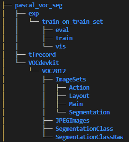
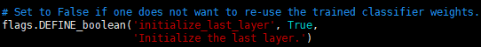

## Step 00: Preparation  
### Dependencies
```python
pip install tensorflow-gpu==1.15
sudo apt-get install python-pil python-numpy
pip install --user jupyter
pip install --user matplotlib
pip install --user PrettyTable
```
### environment  
```bash
# From tensorflow/models/research/
export PYTHONPATH=$PYTHONPATH:`pwd`:`pwd`/slim
```

## Step 01: convert images to tfrecord  

```python
python build_voc2012_data.py \
	--image_folder="./pascal_voc_seg/VOCdevkit/VOC2012/JPEGImages" \
	--semantic_segmentation_folder="./pascal_voc_seg/VOCdevkit/VOC2012/SegmentationClassRaw" \
 	--list_folder="./pascal_voc_seg/VOCdevkit/VOC2012/ImageSets/Segmentation" \ 
	--image_format="jpg" \ 
	--output_dir="./pascal_voc_seg/tfrecord"
```

## Step 02: Train  
### Step 2.1: Modify [segmentation_dataset.py]()  
* modify models/research/deeplab/deprecated/segmentation_dataset.py
[First]()
```python
_SEGTEST_INFORMATION = DatasetDescriptor(
    splits_to_sizes={
        'train': 22,  # num of samples in images/training
        'val': 5,  # num of samples in images/validation
    },
    num_classes=4,
    ignore_label=255,
)
```
[Second]()
```python
_DATASETS_INFORMATION = {
    'cityscapes': _CITYSCAPES_INFORMATION,
    'pascal_voc_seg': _PASCAL_VOC_SEG_INFORMATION,
    'ade20k': _ADE20K_INFORMATION,
    'segtest': _SEGTEST_INFORMATION
}
```

### Step 2.2: Modify [train.py]()  
* modify models/research/deeplab/train.py  



### Step 2.3: train  
```python
DATASET_DIR="/home/cc/dataset/segtest"
 
# Set up the working directories.
SEG_FOLDER="mysegtest"
EXP_FOLDER="exp/train_on_trainval_set"
INIT_FOLDER="${DATASET_DIR}/${SEG_FOLDER}/init_models"
TRAIN_LOGDIR="${DATASET_DIR}/${SEG_FOLDER}/${EXP_FOLDER}/train"
EVAL_LOGDIR="${DATASET_DIR}/${SEG_FOLDER}/${EXP_FOLDER}/eval"
VIS_LOGDIR="${DATASET_DIR}/${SEG_FOLDER}/${EXP_FOLDER}/vis"
EXPORT_DIR="${DATASET_DIR}/${SEG_FOLDER}/${EXP_FOLDER}/export"
mkdir -p "${INIT_FOLDER}"
mkdir -p "${TRAIN_LOGDIR}"
mkdir -p "${EVAL_LOGDIR}"
mkdir -p "${VIS_LOGDIR}"
mkdir -p "${EXPORT_DIR}"
 
SEG_DATASET="${DATASET_DIR}/tfrecord"
 
# Train 10 iterations.
NUM_ITERATIONS=500
python "${WORK_DIR}"/train.py \
  --logtostderr \
  --train_split="train" \
  --model_variant="xception_65" \
  --atrous_rates=6 \
  --atrous_rates=12 \
  --atrous_rates=18 \
  --output_stride=16 \
  --decoder_output_stride=4 \
  --train_crop_size="513,513" \
  --train_batch_size=4 \
  --training_number_of_steps="${NUM_ITERATIONS}" \
  --fine_tune_batch_norm=true \
  --dataset="segtest" \
  --tf_initial_checkpoint="/home/cc/models/research/deeplab/backbone/deeplabv3_cityscapes_train/model.ckpt" \
  --train_logdir="${TRAIN_LOGDIR}" \
  --dataset_dir="${SEG_DATASET}" \
  --initialize_last_layer=False \ 
  --last_layers_contain_logits_only=True
```