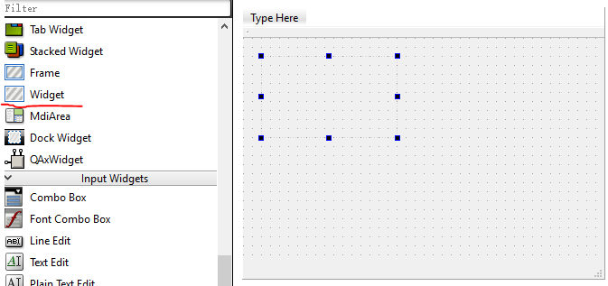
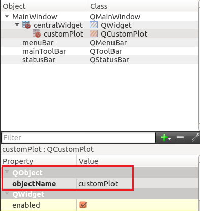

# <center> Installation and Configuration </center>
## Configuration for QCustomPlot
Step1: Download QCustomPlot.h and QCustomPlot.cpp from
[https://www.qcustomplot.com/index.php/download](https://www.qcustomplot.com/index.php/download "QCumstomPlot Official Website")  

Step2: Add the those two file into the project
  
Step3: add printsupport into .pro

step4: add a widget into your project  
  

step5: rename the widget object to customPlot  
  

step6: add the following code  
```
 QVector<double> x(101), y(101); // initialize with entries 0..100
    for (int i=0; i<101; ++i)
    {
      x[i] = i/50.0 - 1; // x goes from -1 to 1
      y[i] = x[i]*x[i]; // let's plot a quadratic function
    }


    // create graph and assign data to it:
    ui->customPlot->addGraph();
    ui->customPlot->graph(0)->setData(x, y);
    // give the axes some labels:
    ui->customPlot->xAxis->setLabel("x");
    ui->customPlot->yAxis->setLabel("y");
    // set axes ranges, so we see all data:
    ui->customPlot->xAxis->setRange(-1, 1);
    ui->customPlot->yAxis->setRange(0, 1);
    ui->customPlot->replot();
```

step7: note
you should add c++11 into .pro  
```
CONFIG+= c++11
```  
you should also add the following code
```  
using namespace std;
```


