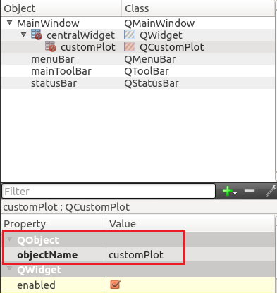

# Install
```
apt-get install qt5-default qtcreator
```

# <center> Configuration QCustomPlot </center>
## QCustonPlot (Ubuntu & QT)
Step1: Download QCustomPlot.h and QCustomPlot.cpp from
[https://www.qcustomplot.com/index.php/download](https://www.qcustomplot.com/index.php/download "QCumstomPlot Official Website")  

Step2: Add the those two file into the project
  
Step3: add printsupport into .pro

step4: add a widget into your project  
  

step5: rename the widget object to customPlot  
  

step6: add the following code  
```
 QVector<double> x(101), y(101); // initialize with entries 0..100
    for (int i=0; i<101; ++i)
    {
      x[i] = i/50.0 - 1; // x goes from -1 to 1
      y[i] = x[i]*x[i]; // let's plot a quadratic function
    }


    // create graph and assign data to it:
    ui->customPlot->addGraph();
    ui->customPlot->graph(0)->setData(x, y);
    // give the axes some labels:
    ui->customPlot->xAxis->setLabel("x");
    ui->customPlot->yAxis->setLabel("y");
    // set axes ranges, so we see all data:
    ui->customPlot->xAxis->setRange(-1, 1);
    ui->customPlot->yAxis->setRange(0, 1);
    ui->customPlot->replot();
```

step7: note
you should add c++11 into .pro  
```
CONFIG+= c++11
```  
you should also add the following code
```  
using namespace std;
```

## Configuration: OpenCV(Ubuntu & QT)
Step 1: Update packages
```
sudo apt-get update
sudo apt-get upgrade
```

Step 2: Install OS libraries
Remove any previous installations of x264</h3>
```
sudo apt-get remove x264 libx264-dev
```
 
We will Install dependencies now
``` 
sudo apt-get install build-essential checkinstall cmake pkg-config yasm
sudo apt-get install git gfortran
sudo apt-get install libjpeg8-dev libjasper-dev libpng12-dev
 
# If you are using Ubuntu 14.04
sudo apt-get install libtiff4-dev
# If you are using Ubuntu 16.04
sudo apt-get install libtiff5-dev
 
sudo apt-get install libavcodec-dev libavformat-dev libswscale-dev libdc1394-22-dev
sudo apt-get install libxine2-dev libv4l-dev
sudo apt-get install libgstreamer0.10-dev libgstreamer-plugins-base0.10-dev
sudo apt-get install qt5-default libgtk2.0-dev libtbb-dev
sudo apt-get install libatlas-base-dev
sudo apt-get install libfaac-dev libmp3lame-dev libtheora-dev
sudo apt-get install libvorbis-dev libxvidcore-dev
sudo apt-get install libopencore-amrnb-dev libopencore-amrwb-dev
sudo apt-get install x264 v4l-utils
 
# Optional dependencies
sudo apt-get install libprotobuf-dev protobuf-compiler
sudo apt-get install libgoogle-glog-dev libgflags-dev
sudo apt-get install libgphoto2-dev libeigen3-dev libhdf5-dev doxygen
Step 3: Install Python libraries
1
2
3
sudo apt-get install python-dev python-pip python3-dev python3-pip
sudo -H pip2 install -U pip numpy
sudo -H pip3 install -U pip numpy
```
We will use Virtual Environment to install Python libraries. It is generally a good practice in order to separate your project environment and global environment.


# Install virtual environment
sudo pip2 install virtualenv virtualenvwrapper
sudo pip3 install virtualenv virtualenvwrapper
echo "# Virtual Environment Wrapper"  >> ~/.bashrc
echo "source /usr/local/bin/virtualenvwrapper.sh" >> ~/.bashrc
source ~/.bashrc
  
############ For Python 2 ############
# create virtual environment
mkvirtualenv facecourse-py2 -p python2
workon facecourse-py2
  
# now install python libraries within this virtual environment
pip install numpy scipy matplotlib scikit-image scikit-learn ipython
  
# quit virtual environment
deactivate
######################################
  
############ For Python 3 ############
# create virtual environment
mkvirtualenv facecourse-py3 -p python3
workon facecourse-py3
  
# now install python libraries within this virtual environment
pip install numpy scipy matplotlib scikit-image scikit-learn ipython
  
# quit virtual environment
deactivate
######################################
Step 4: Download OpenCV and OpenCV_contrib
We will download opencv and opencv_contrib packages from their GitHub repositories.

Step 4.1: Download opencv from Github
1
2
3
4
git clone https://github.com/opencv/opencv.git
cd opencv 
git checkout 3.3.1 
cd ..
Step 4.2: Download opencv_contrib from Github
1
2
3
4
git clone https://github.com/opencv/opencv_contrib.git
cd opencv_contrib
git checkout 3.3.1
cd ..
Step 5: Compile and install OpenCV with contrib modules
Step 5.1: Create a build directory
1
2
3
cd opencv
mkdir build
cd build
Step 5.2: Run CMake
1
2
3
4
5
6
7
8
9
10
cmake -D CMAKE_BUILD_TYPE=RELEASE \
      -D CMAKE_INSTALL_PREFIX=/usr/local \
      -D INSTALL_C_EXAMPLES=ON \
      -D INSTALL_PYTHON_EXAMPLES=ON \
      -D WITH_TBB=ON \
      -D WITH_V4L=ON \
      -D WITH_QT=ON \
      -D WITH_OPENGL=ON \
      -D OPENCV_EXTRA_MODULES_PATH=../../opencv_contrib/modules \
      -D BUILD_EXAMPLES=ON ..
Step 5.3: Compile and Install
1
2
3
4
5
6
7
# find out number of CPU cores in your machine
nproc
# substitute 4 by output of nproc
make -j4
sudo make install
sudo sh -c 'echo "/usr/local/lib" >> /etc/ld.so.conf.d/opencv.conf'
sudo ldconfig
Step 5.4: Create symlink in virtual environment

Depending upon Python version you have, paths would be different. OpenCV’s Python binary (cv2.so) can be installed either in directory site-packages or dist-packages. Use the following command to find out the correct location on your machine.

1
find /usr/local/lib/ -type f -name "cv2*.so"
It should output paths similar to one of these (or two in case OpenCV was compiled for both Python2 and Python3):

1
2
3
4
5
6
7
8
9
10
11
12
13
14
15
############ For Python 2 ############
## binary installed in dist-packages
/usr/local/lib/python2.6/dist-packages/cv2.so
/usr/local/lib/python2.7/dist-packages/cv2.so
## binary installed in site-packages
/usr/local/lib/python2.6/site-packages/cv2.so
/usr/local/lib/python2.7/site-packages/cv2.so
  
############ For Python 3 ############
## binary installed in dist-packages
/usr/local/lib/python3.5/dist-packages/cv2.cpython-35m-x86_64-linux-gnu.so
/usr/local/lib/python3.6/dist-packages/cv2.cpython-36m-x86_64-linux-gnu.so
## binary installed in site-packages
/usr/local/lib/python3.5/site-packages/cv2.cpython-35m-x86_64-linux-gnu.so
/usr/local/lib/python3.6/site-packages/cv2.cpython-36m-x86_64-linux-gnu.so
Double check the exact path on your machine before running the following commands

1
2
3
4
5
6
7
############ For Python 2 ############
cd ~/.virtualenvs/facecourse-py2/lib/python2.7/site-packages
ln -s /usr/local/lib/python2.7/dist-packages/cv2.so cv2.so
  
############ For Python 3 ############
cd ~/.virtualenvs/facecourse-py3/lib/python3.6/site-packages
ln -s /usr/local/lib/python3.6/dist-packages/cv2.cpython-36m-x86_64-linux-gnu.so cv2.so
Step 6: Test OpenCV3
We will test a red eye remover application written in OpenCV to test our C++ and Python installations. Download RedEyeRemover.zip and extract it into a folder.

Step 6.1: Test C++ code
Move inside extracted folder, compile and run.

1
2
3
4
5
# compile
# There are backticks ( ` ) around pkg-config command not single quotes
g++ -std=c++11 removeRedEyes.cpp `pkg-config --libs --cflags opencv` -o removeRedEyes
# run
./removeRedEyes
Step 6.2: Test Python code
Activate Python virtual environment
1
2
3
4
5
############ For Python 2 ############
workon facecourse-py2
 
############ For Python 3 ############
workon facecourse-py3
Quick Check
1
2
3
4
5
6
7
8
# open ipython (run this command on terminal)
ipython
# import cv2 and print version (run following commands in ipython)
import cv2
print cv2.__version__
# If OpenCV3 is installed correctly,
# above command should give output 3.3.1
# Press CTRL+D to exit ipython
Run RedEyeRemover demo
1
python removeRedEyes.py
Now you can exit from Python virtual environment.

1
deactivate
Whenever you are going to run Python scripts which use OpenCV you should activate the virtual environment we created, using workon command.

